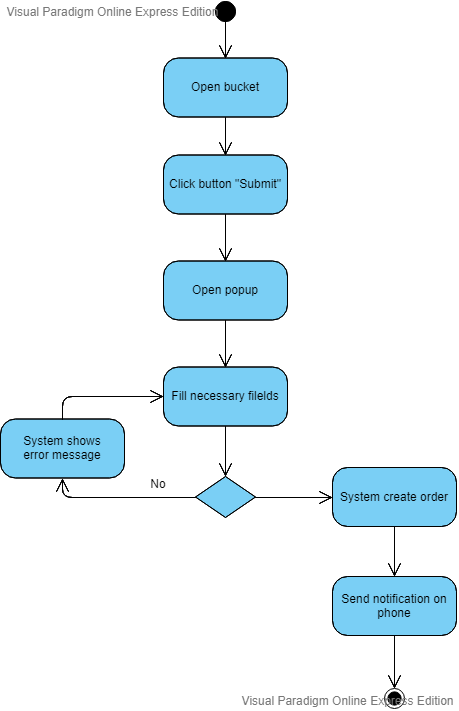

# UML Diagrams

## Содержание

1. [Диаграмма прецедентов](#precedent_diagramm)  
1.1 [Актёры](#actors)  
1.2 [Варианты использования](#variant_usages)  
1.2.1 [Регистрация](#register)  
1.2.2 [Вход в систему](#login)  
1.2.3 [Просмотр продуктов](#view_products)  
1.2.4 [Просмотр детальной информации о продукте](#view_products_detail)  
1.2.5 [Добавление комментария](#add_comment)  
1.2.6 [Просмотр корзины](#view_bucket)  
1.2.7 [Редактирование продуктов в корзине](#edit_products)  
1.2.8 [Оформление заказа](#create_order)  
2. [Диаграммы активностей](#activity_diagramms)  
2.1 [Регистрация](#regist)  
2.2 [Вход в систему](#login_d)  
2.3 [Добавление комментария](#add_comment_d)  
2.4 [Редактирование продуктов в корзине](#edit_products_d)  
2.5 [Оформление заказа](#create_order_d)  
3. [Диаграмма последовательности](#sequence_diagramm)  
4. [Диаграммы состояний](#sost_diagramm)  
4.1 [Регистрация](#register_state)  
4.2 [Добавление продукта в корзину](#add_product_state)  
4.3 [Комментирование](#comment_state)  
4.4 [Создание заказа](#create_order_state)  
5. [Диаграммы класов](#classes_diagramm)  
6. [Диаграмма компонентов и развертывания](#mass_diagramm)  

<a name="precedent_diagramm"/>

## 1 Диаграмма прецедентов

<a name="actors"/>

### 1.1 Актёры
| Актёр | Описание | 
|:---|:---|
| Customer | Человек, который использует приложение для просмотра продуктов. Заказ продуктов недоступен пока не войдёт в систему. |
| Registered customer | Зарегестрированный в системе человек, которому доступен заказ продуктов.|

<a name="variant_usages"/>

### 1.2 Варианты использования

<a name="register"/>

#### 1.2.1 Поток событий для прецедента "Регистрация" :
<strong>Описание:</strong> Вариант использования "Регистрация" позволяет новому пользователю создать свою учетную запись в системе.  
<strong>Поток событий:</strong>  
1. Пользователь нажимает клавишу "Sign Up" на главной панеле.
2. Приложение переходит на страницу регистрации.
3. Пользователь вводит номер телефона и пароль и жмёт кнопку регистрации.
4. Система посылает смс-код на введённый номер телефона.
5. Пользователь вводит полученный смс-код в нужное поле. Если смс-код не пришёл, пользователь сможет запросить его повторно.
6. Приложение добавляет нового пользователя в систему.
7. Конец.

<a name="login"/>

#### 1.2.2 Поток событий для прецедента "Вход в систему" :
<strong>Описание:</strong> Вариант использования "Вход в систему" позволяет новому пользователю авторизоваться в системе.  
<strong>Поток событий:</strong>  
1. Пользователь нажимает клавишу "Log In" на главной панеле.
2. Приложение переходит на страницу входа.
3. Пользователь вводит номер телефона и пароль.
4. Система выполняет проверку на наличие данных в базе данных. Если были введены неверные данные, то пользователь будет уведомлен о неправильных введённых данных, и пользователь будет повторять предыдущее действие.
5. Приложение авторизирует пользователя и перенаправляет на главную страницу.
6. Конец.

<a name="view_products"/>

#### 1.2.3 Поток событий для прецедента "Просмотр продуктов" :
<strong>Описание:</strong> Вариант использования "Просмотр продуктов" позволяет пользователю просмотривать продукты.  
<strong>Поток событий:</strong>  
1. Пользователь нажимает клавишу "Menu" на главной панеле.
2. Приложение переходит на главную страницу, где будет 4 категории продуктов(горячие блюла, завтраки, обеды, салаты).
3. Нажав на любую из них, пользователь перейдёт к просмотру товаров этой категории.
4. Продукты на странице будут представелены по 4. Внизу страницы будет пагинация для удобного просмотра.
5. Конец.

<a name="view_products_detail"/>

#### 1.2.4 Поток событий для прецедента "Просмотр детальной информации о продукте" :
<strong>Описание:</strong> Вариант использования "Просмотр детальной информации о продукте" позволяет пользователю просматривать подробную информация о продукте, а также добавлять продукт в корзину..  
<strong>Поток событий:</strong>  
1. Пользователь нажимает на определённый продукт.
2. Приложение переходит на страницу детального просмотра выбранного продукта.
3. Пользователь просматривает информацию о продукте.
4  Если пользователь авторизован в системе, то у него есть возможность оставить комментарий. Если он нажимает на поле ввода коментария, то переходит к использованию варианта Добавление комментария.
5. Конец.  

<a name="add_comment"/>

#### 1.2.5 Поток событий для прецедента "Добавление комментария" :
<strong>Описание:</strong> Вариант использования "Добавление комментария" позволяет авторизированному пользователю оставить комментарий на странице продукта.  
<strong>Поток событий:</strong>  
1. Пользователь нажимает на определённый продукт.
2. Приложение переходит на страницу детального просмотра выбранного продукта.
3. Внизу страницы пользователь может посмотреть оставленные комментарии и оставить свой.
4. После введения комментария в поле ввода и нажатия кнопки "Save" комментарий сохранится в базе данных и будет виден на этой странице.
5. Конец. 

<a name="view_bucket"/>

#### 1.2.6 Поток событий для прецедента "Просмотр корзины" :
<strong>Описание:</strong> Вариант использования "Просмотр корзины" позволяет авторизированному пользователю просмотривать выбранные продукты для их редактирования и заказа.  
<strong>Поток событий:</strong>  
1. Авторизированный пользователь нажимает на иконку тележки на главной панели.
2. Приложение переходит на страницу корзины.
3. Пользователь просматривает выбранные продукты для заказа.
4. Если пользователь захотел изменить количество заказанных продуктов, то переходит к варианту использованию Редактирование продуктов в корзине.
5. Если пользователь нажал на кнопку "Submit", то переходит к варианту использования Оформление заказа.
6. Конец. 

<a name="edit_products"/>

#### 1.2.7 Поток событий для прецедента "Редактирование продуктов в корзине" :
<strong>Описание:</strong> Вариант использования "Редактирование продуктов в корзине" позволяет авторизированному пользователю редактировать выбранные продукты перед заказом.  
<strong>Поток событий:</strong>  
1. Авторизированный пользователь нажимает на иконку тележки на главной панели.
2. Приложение переходит на страницу корзины.
3. Пользователь редактирует количество продуктов, нажимая на "+" и "-" или сразу вводя нужное ему число.
4. Конец. 

<a name="create_order"/>

#### 1.2.8 Поток событий для прецедента "Оформление заказа" :
<strong>Описание:</strong> Вариант использования "Оформление заказа" позволяет авторизированному пользователю совершить заказ.  
<strong>Поток событий:</strong>  
1. Авторизированный пользователь нажимает на иконку тележки на главной панели.
2. Приложение переходит на страницу корзины.
3. Пользователь нажимает на кнопку "Submit".
4. На экране всплывает popup, в котором пользователь выбирает пункт самовывоза и жмёт кнопку "Submit".
5. Система создаёт заказ и посылает оповещение на номер телефона пользователя о его создании.
4. Конец. 

<a name="activity_diagramms"/>

## 2 Диаграммы активностей

<a name="regist"/>

### 2.1 Регистрация
Пользователь заполняет все необходимые поля. Одновременно с этим система их валидирует и в случае ошибки выводит соответствующее сообщение. Если валидация прошла успешно, то на номер телефона послыается код подтверждения, который необходимо заполнить для успешной регистраци.
Если он не пришёл, пользователь может запросить его снова.  В случае успеха пользователь перенаправляется на главную страницу.

<a name="login_d"/>

### 2.2 Вход в систему
Пользователь заполняет все необходимые поля. Система проверяет на наличие такого пользователя в системе, если такого нету, то выводит соответсвующее сообщение. В случае успеха пользователь перенаправляется на главную страницу.

<a name="add_comment_d"/>

### 2.3 Добавление комментария
На странице детальной информации продукта, пользователь видит комментарии. Он может добавить комментарий, нажав на поле ввода, введя свой комментарий и нажав на кнопку "Save". Также может удалить ранее добавленный комментарий, нажав на иконку крестика.

<a name="edit_products_d"/>

### 2.4 Редактирование продуктов в корзине
Пользователь переходит в корзину, нажав иконку тележки на главной панели. Там он может редактировать выбранные продукты: удалить ненужные или поменять их количество.

<a name="create_order_d"/>
    
### 2.5 Оформление заказа
При нажатии на иконку корзины на главной панели происходит переход на страницу корзины. Просматривает свои выбранные продукты и, если всё в порядке, нажимает на кнопку "Submit". На экране открывается всплываеющееся окно, в котором пользователь выбирает пункт самовывоза или пункт доставки и нажимает кнопку "Submit". Пользователю на номер телефона приходит подтверждение заказа.

<a name="sequence_diagramm"/>

## 3 Диаграмма последовательности
Диаграмма последовательности основных вариантов использования представлена ниже:

<a name="sost_diagramm"/>

## 4 Диаграммы состояний

<a name="register_state"/>

### 4.1 Регистрация

<a name="add_product_state"/>

### 4.2 Добавление продукта в корзину
Окно добавления продукта в корзину: https://github.com/KirillBelitsky/Cafe/blob/master/Documents/Mockups/mockup_breakfastNew.PNG

<a name="comment_state"/>

### 4.3 Комментирование
Пример окна с возможностью комментирования: https://github.com/KirillBelitsky/Cafe/blob/master/Documents/Mockups/mockup_dishUpdate.PNG

<a name="create_order_state"/>

### 4.4 Создание заказа
Пример окна с создание заказа: https://github.com/KirillBelitsky/Cafe/blob/master/Documents/Mockups/mockup_basket.PNG

<a name="classes_diagramm"/>

## 5 Диаграммы классов

<a name="mass_diagramm"/>

## 6 Диаграмма компонентов и развертывания

