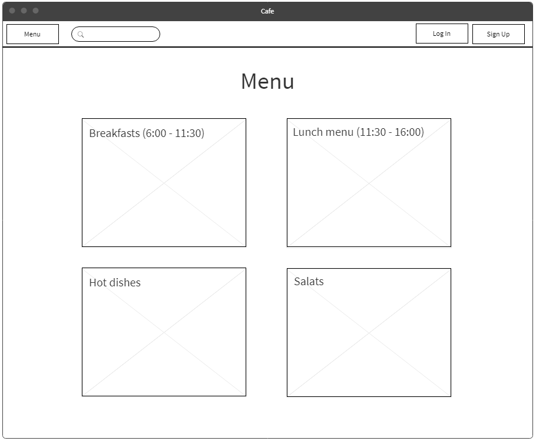
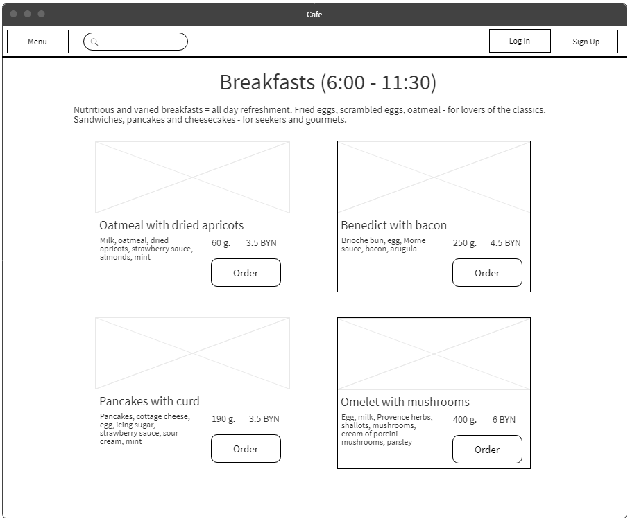
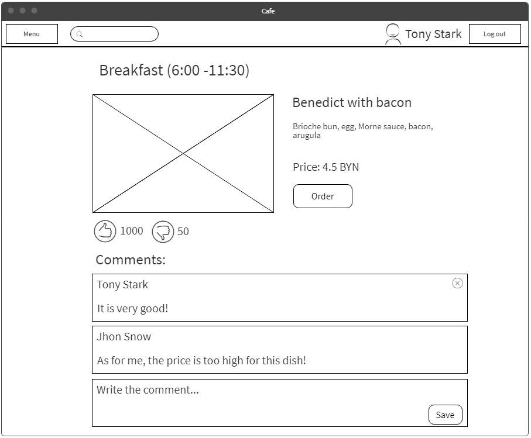
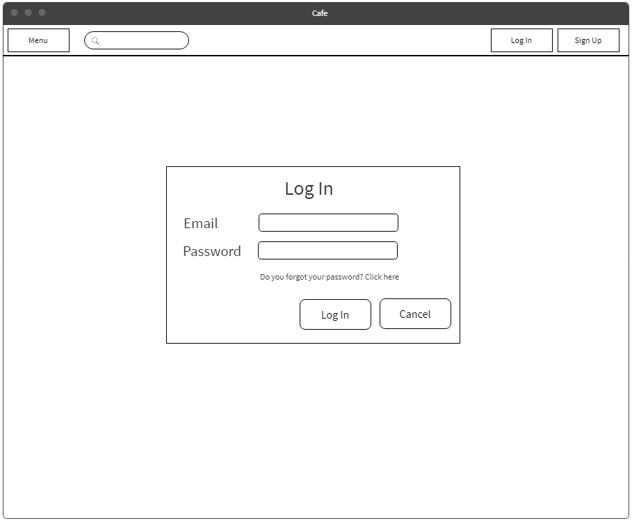
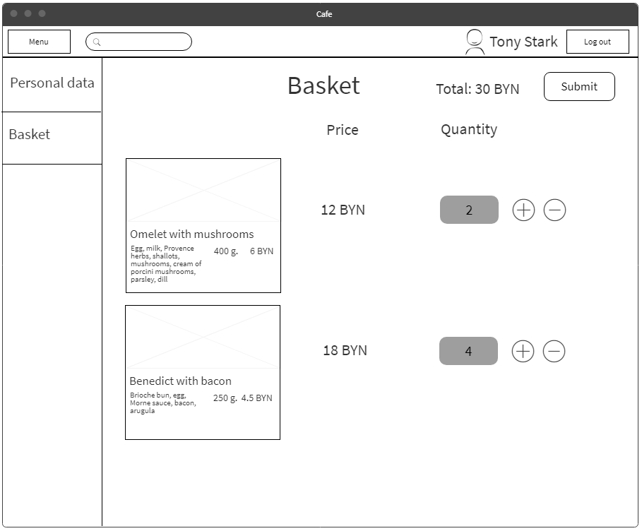

# Требования к проекту

## Содержание
 
1 [Введение](#intro)  
2 [Требования пользователя](#user_requirements)  
2.1 [Программные интерфесы](#program_interfaces)  
2.2 [Интерфейс пользователя](#user_interface)  
2.3 [Характеристика пользователей](#charact_users)  
2.3.1 [Аудитория приложения](#audit_app)  
3 [Системные требования](#system_requirements)  
3.1 [Функциональные требования](#functional_requirements)  
3.2 [Нефункциональные требования](#nofunctional_requirements)  
3.2.1 [Атрибуты качества](#attr_quality)  
3.2.1.1 [Требования к удобству использования](#requir_convenience_usages)  
3.2.1.2 [Требования к безопасности](#requir_security)  
3.2.2 [Ограничения](#restrictions)  
4 [Аналоги](#analogs)

## Глоссарий
* Spring Framework — универсальный фреймворк с открытым исходным кодом для Java-платформы.
* Angular — это открытая и свободная платформа для разработки веб-приложений, написанная на языке TypeScript, разрабатываемая командой из компании Google.
* PostgreSQL — свободная объектно-реляционная система управления базами данных.
* Пагинация — это порядковая нумерация страниц.

<a name="intro"/>

## 1 Введение 
В проекте "Cafe" будет реализовано интернет-кафе. В данном интернет-приложении пользователь сможет делать онлайн заказы и впоследствии забирать их в самом кафе, благодаря чему ему не придется тратить время в очереди и на ожидание выполнения заказа. Помимо меню кафе и системы заказа будет создана система оповещения о выполнении заказа.

<a name="user_requirements"/>

## 2  Требования пользователя

<a name="program_interfaces"/>

### 2.1  Требования пользователя
Проект будет написан на языке Java с использованием Spring Framework. Пользовательский интерфейс будет реализован на Angular Framework. Для хранения данных будет использована база данных PostgreSQL.

<a name="user_interface"/>

### 2.2 Интерфейс пользователя   
* Главная страница

* Страница определённого меню
 
* Страница блюда

* Страница аутентификации

* Корзина

<a name="charact_users"/>

### 2.3 Характеристика пользователей

<a name="audit_app"/>

#### 2.3.1 Аудитория приложения
Люди, которые всегда находятся в движении и у которых нету времени стоять в очередях, чтобы купить поесть.

<a name="system_requirements"/>

## 3 Систенмые требования

<a name="functional_requirements"/>

### 3.1 Функциональные требования
Пользователю предоставлены возможности:

| Функция | Требования | 
|:---|:---|
| Регистрация | Должна быть возможность зарегестрировать пользователя в систему. Также при этом должен выполняться автоматический вход в систему. |
| Авторизация и аутентификация | Должно проверяться на наличие пользователя в системе и присваиваются ему его права.|
| Просмотр меню | Возможность просмотра меню всеми пользователями. |
| Просмотр детальной информации о блюде | Приложение должно показать всю информацию о выбранном блюде. |
| Просмотр профиля | Просмотр информации вошедшего пользователя в систему   . |
| Добавление в корзину | Система должна поместить выбранный продукт в корзину. |
| Просмотр корзины | Просмотр товаров, добавленных в корзину.|
| Восстановление пароля | Должна быть возможность восстановления пароля, если пользователь его забыл. |

<a name="nofunctional_requirements"/>

### 3.2 Нефункциональные требования

<a name="attr_quality"/>

#### 3.2.1 Аттрибуты качества
Важными атрибутами являются высокая производительность, малое потребление ресурсов, удобный интерфейс, отсутствие рекламы, защищённость пользовательских данных.

<a name="requir_convenience_usages"/>

##### 3.2.1.1 Требования к удобству использования
* Должен быть реализован понятный и удобный пользователю интерфейс.
* При большом количестве товаров должна быть сделана пагинация для удобного просмотра.

<a name="requir_security"/>

##### 3.2.1.2 Требования к безопасности
* Администраторы имеют доступ к базе данных.
* Пароль пользователя должен кодироваться при регистрации.
* Должна быть реализована функция смены пароля, если пользователь его забыл.
* При регистрации пользователю на почту должно приходить

<a name="restrictions"/>

#### 3.2.2 Ограничения
* Прилжение реализовано на языке Java.
* Для браузеров ограничений нет.

## 4 Аналоги
Аналогами проекта являются https://garage.by/ и https://texas-chicken.by/.
